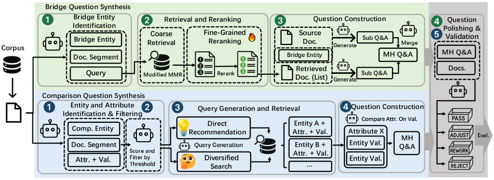
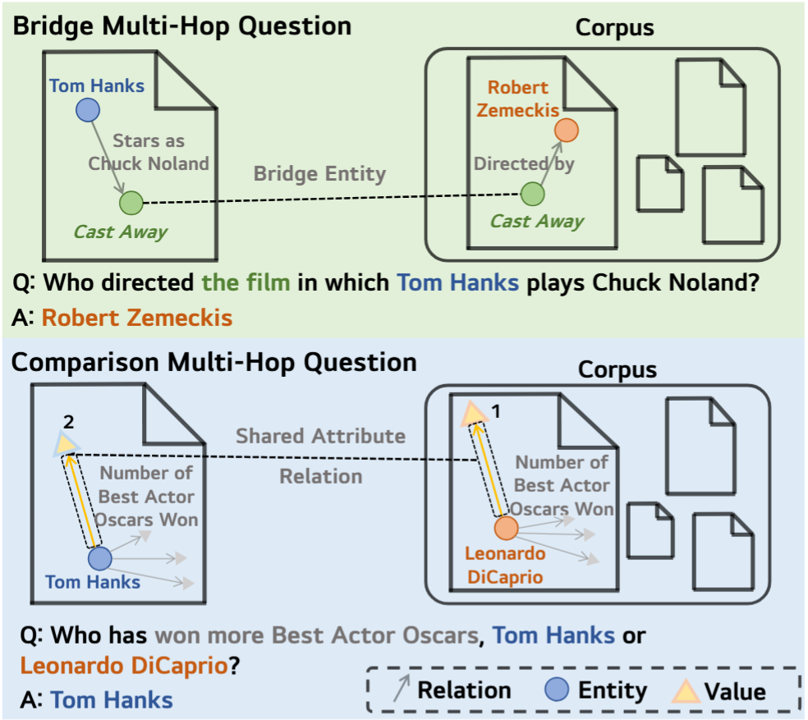
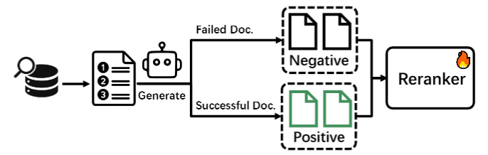
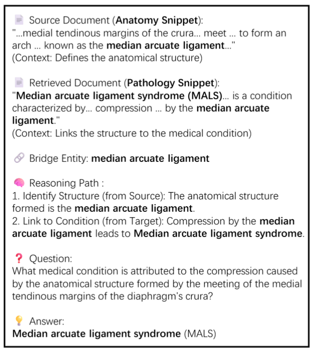
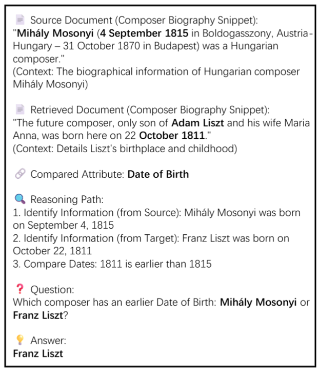

<div align="center">

# 🧵 HopWeaver: Synthesizing Authentic Multi-Hop Questions Across Text Corpora

<p><strong>The first fully automated framework for synthesizing high-quality multi-hop questions from unstructured text corpora across documents without human intervention</strong></p>

<p align="center">
  <a href="https://arxiv.org/abs/2505.15087"></a>
  <a href="https://huggingface.co/datasets/Shenzy2/HopWeaver_Data"></a>
  <a href="https://www.modelscope.cn/datasets/szyszy/HopWeaver_Data"></a>
  <a href="https://github.com/Zh1yuShen/HopWeaver/blob/main/LICENSE"></a>
  <a href="https://www.python.org/"></a>
</p>

## 🌟 Key Features

- **🥇 First-of-its-kind**: Fully automated cross-document multi-hop question synthesis from unstructured corpora without manual annotation
- **💰 Cost-Effective**: Synthesizes high-quality questions at significantly lower cost than manual methods  
- **🎯 Quality Assured**: Three-dimensional evaluation system ensuring authentic multi-hop reasoning
- **🔄 Two Question Types**: Bridge questions (entity connections) and comparison questions (attribute analysis)
- **📊 Empirically Validated**: Quality comparable to or exceeding human-annotated datasets

---

**HopWeaver automatically synthesizes authentic cross-document multi-hop questions from unstructured text corpora, enabling cost-effective creation of high-quality MHQA datasets for specialized domains with scarce annotated resources.**

[English](README.md) | [中文](README_CN.md)



</div>

## 📋 Table of Contents

- [🚀 Quick Start](#-quick-start)
- [🔎 Project Overview](#-project-overview)
- [🏗️ System Architecture](#-system-architecture)
- [🔧 Core Functional Modules](CORE_MODULES.md)
- [🔄 Reranker Model Training](#-reranker-model-training)
- [📚 Usage Guide](#-usage-guide)
  - [🛠️ Environment and Data Preparation](ENVIRONMENT_SETUP.md)
  - [Question Synthesis and Evaluation](#question-synthesis-and-evaluation)
  - [Self-Consistency Evaluation](#self-consistency-evaluation)
- [📝 Examples](#-examples)
  - [Bridge Question Examples](#bridge-question-examples)
  - [Comparison Question Examples](#comparison-question-examples)
- [📜 Citation](#-citation)
- [🔐 License](#-license)

## 🚀 Quick Start

This section provides a minimal guide to quickly get HopWeaver running and generate a few sample questions. For more detailed configurations, please refer to the [📚 Usage Guide](#-usage-guide) section.

1.  **Clone the Repository and Install Dependencies:**
    ```bash
    git clone https://github.com/Zh1yuShen/HopWeaver.git
    cd HopWeaver
    pip install -r requirements.txt
    ```

2.  **Prepare Core Data and Models:**
    *   **Download Preprocessed Wiki Dataset:** Download the `wiki18_fulldoc_trimmed_4096.jsonl` file from [Hugging Face](https://huggingface.co/datasets/Shenzy2/HopWeaver_Data) or [ModelScope](https://www.modelscope.cn/datasets/szyszy/HopWeaver_Data).
    *   **Download GTE Embedding Model:** Download the GTE model (usually a folder containing multiple files) from [Hugging Face](https://huggingface.co/iic/gte_sentence-embedding_multilingual-base).
    *   **Download Pre-built FAISS Index:** Download the pre-built `gte_Flat.index` file (recommended) from [Hugging Face](https://huggingface.co/datasets/Shenzy2/HopWeaver_Data) or [ModelScope](https://www.modelscope.cn/datasets/szyszy/HopWeaver_Data).

3.  **Configure API and Paths:**
    *   Copy `config_lib/example_config.yaml` and rename it, for example, to `config_lib/my_quickstart_config.yaml` (or you can directly modify `example_config.yaml`, but this is not recommended for preserving the original example).
    *   **LLM API Key and Model Configuration:**
        In your configuration file (e.g., `my_quickstart_config.yaml`), set your LLM API key. The system uses keywords in the `generator_model` name (specified in the YAML) to select the API settings block (e.g., `openai_setting`, `google_setting`). 
        Ensure the `generator_model` you choose corresponds to a correctly configured `*_setting` block in your YAML, complete with `api_keys` and `base_url`.

        For example, if `generator_model: "gpt-4o"` is set, the `openai_setting` block will be used:
        ```yaml
        # OpenAI settings (used if model name implies OpenAI, or by default)
        openai_setting:
          api_keys:
            - "YOUR_OPENAI_API_KEY" # <--- Set your OpenAI key
          base_url: "https://api.openai.com/v1"

        # Define other settings like google_setting, anthropic_setting if needed,
        # ensuring they match your chosen generator_model. For example:
        # google_setting:
        #   api_key: "YOUR_GOOGLE_API_KEY"
        #   base_url: "https://generativelanguage.googleapis.com/v1" 
        # anthropic_setting:
        #   api_key: "YOUR_ANTHROPIC_API_KEY"
        #   base_url: "https://api.anthropic.com"

        # Model selection for various components.
        # Each model name (if it uses a generator that relies on keyword-based setting selection, 
        # like openai_generator.py) dictates which *_setting block (e.g., openai_setting, google_setting) 
        # must be correctly configured with API keys and base_url.
        generator_model: "gpt-4o"
        entity_extractor_model: "gpt-4o" # Ensure openai_setting is configured if this uses gpt-4o
        question_generator_model: "gpt-4o" # Ensure openai_setting is configured
        polisher_model: "gpt-4o"           # Ensure openai_setting is configured
        filter_model: "gpt-4o"             # Ensure openai_setting is configured
        ```
    *   **Data and Model Paths:** Update the following paths in your configuration file to point to the files and model folder you downloaded in Step 2:
        ```yaml
        # Global Path Mappings
        model2path:
          gte: "full/path/to/your/downloaded/GTE/model_folder" # <--- Modify here, e.g., /home/user/models/gte_sentence-embedding_multilingual-base

        # Pooling methods for each embedding model (GTE typically uses cls, usually no change needed here)
        model2pooling:
          gte: "cls"

        # Index paths for retrieval models
        method2index:
          gte: 'full/path/to/your/downloaded/gte_Flat.index_file' # <--- Modify here, e.g., /home/user/data/HopWeaver/index/gte_Flat.index

        # Corpus paths for different methods
        method2corpus:
          gte: 'full/path/to/your/downloaded/wiki18_fulldoc_trimmed_4096.jsonl_file' # <--- Modify here, e.g., /home/user/data/HopWeaver/datasets/wiki18_fulldoc_trimmed_4096.jsonl
        ```
        *Please ensure you replace `"YOUR_OPENAI_API_KEY"` and `"full/path/to/your/..."` with your actual key and the absolute paths to your local files/folders.*

4.  **Run Sample Synthesis:**
    Use your configured file (e.g., `my_quickstart_config.yaml`) to run a simple bridge question synthesis task:
    ```bash
    python -m hopweaver.generate_and_evaluate_bridge --config ./config_lib/my_quickstart_config.yaml --count 3 --name quick_test_bridge
    ```
    This will generate 3 bridge questions and save the results in the `output/quick_test_bridge/` directory.

After completing these steps, you should be able to run HopWeaver successfully. For more advanced features and customization options, please continue reading the detailed usage guide that follows.

## 🔎 Project Overview

The HopWeaver system is built on the FlashRAG framework and specifically designed for synthesizing and evaluating high-quality multi-hop questions. The system includes two main question synthesis paths:

1. **Bridge Question Synthesis**: Synthesizes questions requiring multi-step reasoning by extracting entities and establishing connections between them
2. **Comparison Question Synthesis**: Synthesizes questions that require comparing features of multiple entities




## 🏗️ System Architecture

The entire system consists of the following core components:

```
HopWeaver/
├── datasets/              # Datasets directory (containing hotpotqa, 2wiki, musique datasets)
├── fig/                   # Documentation images directory
├── flashrag/              # FlashRAG framework base code
│   ├── config/            # Base configuration module
│   ├── dataset/           # Dataset processing module
│   ├── generator/         # Generator module
│   ├── retriever/         # Retriever module
│   ├── evaluator/         # Evaluator module
│   └── utils/             # Common utility functions
│
├── hopweaver/             # HopWeaver core code
│   ├── components/        # Main components
│   │   ├── bridge/        # Bridge question components
│   │   ├── compare/       # Comparison question components
│   │   └── utils/         # Common utility functions
│   ├── config_lib/        # Configuration files directory
│   ├── evaluation_system/ # Evaluation system
│   └── train_reranker/    # Reranker model training tools
│
└── requirements.txt       # Project dependencies
```

Some functions of HopWeaver depend on the FlashRAG framework. The `flashrag` directory contains the basic framework code (with minor modifications), while the `hopweaver` directory contains specific components and functions for multi-hop question synthesis and evaluation.

For a detailed explanation of the core functional modules, please see the [Core Functional Modules Guide](CORE_MODULES.md).

## 🔄 Reranker Model Training

The project includes a dedicated reranker model training system to optimize the ranking of document retrieval results:

- 📊 Contrastive learning data synthesis
- ⚡ Training based on DeepSpeed
- 🧪 Reranker model ablation experiments

## 📚 Usage Guide

For detailed environment and data preparation instructions, please see the [Environment and Data Preparation Guide](ENVIRONMENT_SETUP.md).

### Question Synthesis and Evaluation

#### Bridge Question Synthesis

```bash
# Synthesize and evaluate bridge questions (basic)
python -m hopweaver.generate_and_evaluate_bridge --config ./config_lib/bridge_default_config.yaml


# Synthesize bridge questions with reranking retriever and custom weights
python -m hopweaver.generate_and_evaluate_bridge --config ./config_lib/bridge_default_config.yaml --retriever rerank --count 50 --name test_rerank --lambda1 0.87 --lambda2 0.03 --lambda3 0.1

# Synthesize bridge questions with custom configuration file
python -m hopweaver.generate_and_evaluate_bridge --config ./config_lib/your_custom_config.yaml --count 20 --name custom_test

# Evaluate existing bridge questions dataset
python -m hopweaver.generate_and_evaluate_bridge --config ./config_lib/bridge_default_config.yaml --eval-only --dataset-path ./datasets/bridge_questions.json
```

#### Comparison Question Synthesis

```bash
# Synthesize and evaluate comparison questions (basic)
python -m hopweaver.generate_and_evaluate_comparison --config ./config_lib/example_config.yaml

# Synthesize 30 comparison questions with a specific name prefix
python -m hopweaver.generate_and_evaluate_comparison --config ./config_lib/example_config.yaml --count 30 --name test_comparison

# Synthesize comparison questions with custom configuration file and output directory
python -m hopweaver.generate_and_evaluate_comparison --config ./config_lib/your_custom_config.yaml --count 50 --name test_comparison --output-dir ./output_comparison

# Evaluate existing comparison questions dataset
python -m hopweaver.generate_and_evaluate_comparison --config ./config_lib/example_config.yaml --eval-only --dataset-path ./datasets/comparison_questions.json
```

#### Generation-Only Mode (Without Evaluation)

If you only want to synthesize questions without evaluation, you can use the standalone question synthesizers:

**Bridge Question Generation Only:**

```bash
# Generate bridge questions without evaluation
python -m hopweaver.bridge_question_synthesizer --config ./config_lib/example_config.yaml --count 10

# Generate with rerank retriever
python -m hopweaver.bridge_question_synthesizer --config ./config_lib/example_config.yaml --count 15 --retriever rerank

# Generate with custom lambda parameters and rerank retriever
python -m hopweaver.bridge_question_synthesizer --config ./config_lib/example_config.yaml --count 20 --retriever rerank --lambda1 0.87 --lambda2 0.03 --lambda3 0.1

# Generate with diverse retriever (default)
python -m hopweaver.bridge_question_synthesizer --config ./config_lib/example_config.yaml --count 10 --retriever diverse
```

**Comparison Question Generation Only:**

```bash
# Generate comparison questions without evaluation
python -m hopweaver.comparison_question_synthesizer --config ./config_lib/example_config.yaml --count 10

# Generate with rerank retriever
python -m hopweaver.comparison_question_synthesizer --config ./config_lib/example_config.yaml --count 15 --retriever rerank

# Generate with custom output directory and rerank retriever
python -m hopweaver.comparison_question_synthesizer --config ./config_lib/example_config.yaml --count 20 --output-dir ./my_output --retriever rerank

# Generate with specific name prefix and diverse retriever
python -m hopweaver.comparison_question_synthesizer --config ./config_lib/example_config.yaml --count 15 --name my_comparison_test --retriever diverse
```

#### Parameters Explanation

- `--config`: Path to configuration file (default: ./config_lib/example_config.yaml)
- `--count`: Number of questions to synthesize (default: 10)
- `--name`: Dataset name prefix for distinguishing different synthesis batches
- `--retriever`: Retriever type, options: 'standard', 'diverse' or 'rerank' (default: 'diverse')
- `--eval-only`: Only evaluate existing questions without synthesizing new ones
- `--dataset-path`: Path to the dataset to evaluate (only used when eval-only is True)
- `--lambda1`: Query relevance weight (0 to 1, default: 0.8), higher values emphasize document-query relevance
- `--lambda2`: Original document diversity weight (0 to 1, default: 0.1), higher values emphasize diversity from source document
- `--lambda3`: Selected document diversity weight (0 to 1, default: 0.1), higher values emphasize diversity among selected documents

### Self-Consistency Evaluation

```bash
# Basic self-consistency evaluation
python -m hopweaver.judge_evaluation_self_con --config ./config_lib/example_config.yaml

# Self-consistency evaluation with custom parameters
python -m hopweaver.judge_evaluation_self_con \
  --config ./config_lib/example_config.yaml \
  --bridge ./datasets/bridge_questions.json \
  --comparison ./datasets/comparison_questions.json \
  --num_samples 20 \
  --repeats 5 \
  --output_dir ./eval_result/custom_stability \
  --max_workers 1

# Evaluate only specific models
python -m hopweaver.judge_evaluation_self_con \
  --models "gpt-4o-2024-11-20,claude-3-7-sonnet-20250219,gemini-2.0-flash"

# Only perform visualization and metric calculation (no new evaluations)
python -m hopweaver.judge_evaluation_self_con --results_dir ./eval_result/stability/20250521_123456
```

#### Parameter Description

- `--config`: Path to configuration file (default: ./config_lib/example_config.yaml)
- `--bridge`: Path to bridge type dataset (default: ./datasets/2wiki_bridge.json)
- `--comparison`: Path to comparison type dataset (default: ./datasets/2wiki_comparison.json)
- `--num_samples`: Number of samples to select for each type (default: 25)
- `--repeats`: Number of evaluation repetitions for each sample (default: 5)
- `--output_dir`: Output directory (default: ./eval_result/stability)
- `--max_workers`: Maximum number of parallel worker threads (default: 1)
- `--test`: Test mode, evaluate only one sample per model (flag parameter)
- `--results_dir`: Existing evaluation results directory, only perform visualization and metric calculation
- `--models`: Comma-separated list of models to evaluate

## 📝 Examples

### Bridge Question Examples



<details>
<summary>Click to expand for detailed explanation</summary>

#### 1. Source and Target Document Content

**Document A - Anatomy Domain Document**  
Title: Crus of diaphragm

Excerpt:
> Crus of diaphragm\nCrus of diaphragm The crus of diaphragm (pl. crura), refers to one of two tendinous structures that extends below the diaphragm to the vertebral column. There is a right crus and a left crus, which together form a tether for muscular contraction. They take their name from their leg-shaped appearance – "crus" meaning "leg" in Latin. The crura originate from the front of the bodies and intervertebral fibrocartilage of the lumbar vertebrae. They are tendinous and blend with the anterior longitudinal ligament of the vertebral column. The medial tendinous margins of the crura pass anteriorly and medialward, and meet in the middle line to form an arch across the front of the aorta known as the median arcuate ligament; this arch is often poorly defined. The area behind this arch is known as the aortic hiatus.

Key summary:
Describes the anatomical structure of the crus of diaphragm, particularly how the medial tendinous margins of the right and left crura converge in front of the aorta to form the median arcuate ligament (MAL), creating the aortic hiatus.

**Document B - Pathology Domain Document**  
Title: Median arcuate ligament syndrome

Excerpt:
> Median arcuate ligament syndrome\nMedian arcuate ligament syndrome In medicine, the median arcuate ligament syndrome (MALS, also known as celiac artery compression syndrome, celiac axis syndrome, celiac trunk compression syndrome or Dunbar syndrome) is a condition characterized by abdominal pain attributed to compression of the celiac artery and the celiac ganglia by the median arcuate ligament. The abdominal pain may be related to meals, may be accompanied by weight loss, and may be associated with an abdominal bruit heard by a clinician. The diagnosis of MALS is one of exclusion, as many healthy patients demonstrate some degree of celiac artery compression in the absence of symptoms.

Key summary:
Defines median arcuate ligament syndrome (MALS) as a condition caused by the median arcuate ligament compressing the celiac artery and ganglia, resulting in abdominal pain, weight loss, and other symptoms.

---

#### 2. Bridge Entity and Its Role

- Bridge Entity Name: **Median Arcuate Ligament**
- Type: Anatomical Structure
- Connecting Function:
    - Document A describes in detail how the "median arcuate ligament" is formed from the crus of diaphragm.
    - Document B explains how this "median arcuate ligament" can lead to a clinical syndrome (MALS) under certain conditions.
    - Thus, the "median arcuate ligament" serves as a core anatomical structure, establishing a bridge between the documents from **"what it is" (anatomical composition) to "what it does" (clinical impact)**.

---

#### 3. Sub-question Construction and Reasoning Analysis

**Reasoning Logic Connection:**  
The anatomical structure of the median arcuate ligament (from Document A) is directly related to its pathophysiological mechanism of compressing the celiac artery leading to median arcuate ligament syndrome (MALS) (from Document B).

**Example Sub-questions:**

- Sub-question 1 (from Document A):  
  Question: What arch-like structure is formed by the medial tendinous margins of the crus of diaphragm meeting in front of the aorta?  
  Answer: Median arcuate ligament  
  Source: Document A

- Sub-question 2 (from Document B):  
  Question: What syndrome is caused when the median arcuate ligament compresses the celiac artery and ganglia?  
  Answer: Median arcuate ligament syndrome (MALS)  
  Source: Document B

**Reasoning Path:**  
Document A clarifies the anatomical origin of the median arcuate ligament (formed by the crus of diaphragm, creating the aortic hiatus), providing its structural basis. Document B explains how this structure can potentially compress the celiac artery and ganglia in pathological conditions, leading to MALS.

---

#### 4. Multi-hop Question Synthesis

**Multi-hop Question:**  
Question: What syndrome is caused when the anatomical structure formed by the convergence of the crus of diaphragm at the aorta compresses the celiac artery and ganglia?  
Answer: Median arcuate ligament syndrome (MALS)

**Reasoning Path:**  
- Document A identifies the "median arcuate ligament" as the anatomical structure formed by the crus of diaphragm converging at the aorta, creating the aortic hiatus.
- Document B explains that pathological compression by this ligament on the celiac artery and ganglia leads to "median arcuate ligament syndrome."
- The question requires identifying the anatomical structure in Document A and understanding its clinical consequences in Document B, connecting them through the implied structural relationship.

</details>

### Comparison Question Examples



<details>
<summary>Click to expand for detailed explanation</summary>

#### 1. Source and Target Document Content Extracts

**Source Document (Composer Biography Snippet):**  
Mihály Mosonyi (born September 4, 1815 in Boldogasszony, Austria-Hungary, died October 31, 1870 in Budapest) was a Hungarian composer. Originally named Michael Brand, he later changed his name to Mosonyi in honor of his home region of Moson. "Mihály" is the Hungarian form of Michael. He was dedicated to creating instrumental music with a Hungarian national style. His notable works include "Funeral Music" and "Purification Festival."

**Target Document (Composer Biography Snippet):**  
Adam Liszt (father of the composer) was the shepherd supervisor at the Esterházy estate and also a musician. Franz Liszt, the only son of Adam Liszt and Maria Anna, was born on October 22, 1811 in Raiding and baptized the following day. Liszt began learning music from his father at the age of six, and the family later moved to Vienna. Liszt became one of the most famous Hungarian composers of the 19th century.

---

#### 2. Connection Between Documents

- Both documents provide birth dates and early life information for their respective composers.
- Through the "birth date" attribute, a direct comparison relationship can be established.

---

#### 3. Multi-hop Reasoning Path Construction

**Reasoning Path:**  
- Information Extraction (Document A): Identify Mihály Mosonyi's birth date as September 4, 1815.
- Information Extraction (Document B): Identify Franz Liszt's birth date as October 22, 1811.
- Comparative Analysis: Compare the two dates and determine that 1811 is earlier than 1815.
- Multi-hop Question Construction: Based on the above reasoning chain, formulate the comparative question "which composer was born earlier."

---

#### 4. Final Multi-hop Comparison Question Example

**Question:**  
Which composer was born earlier: Mihály Mosonyi or Franz Liszt?

**Answer:**  
Franz Liszt

</details>

## 📜 Citation

If you use HopWeaver in your research, please cite our work:

```bibtex
@misc{shen2025hopweaversynthesizingauthenticmultihop,
      title={HopWeaver: Synthesizing Authentic Multi-Hop Questions Across Text Corpora}, 
      author={Zhiyu Shen and Jiyuan Liu and Yunhe Pang and Yanghui Rao},
      year={2025},
      eprint={2505.15087},
      archivePrefix={arXiv},
      primaryClass={cs.CL},
      url={https://arxiv.org/abs/2505.15087}, 
}
```

## 🔐 License

This project is licensed under the MIT License - see the [LICENSE](LICENSE) file for details.

