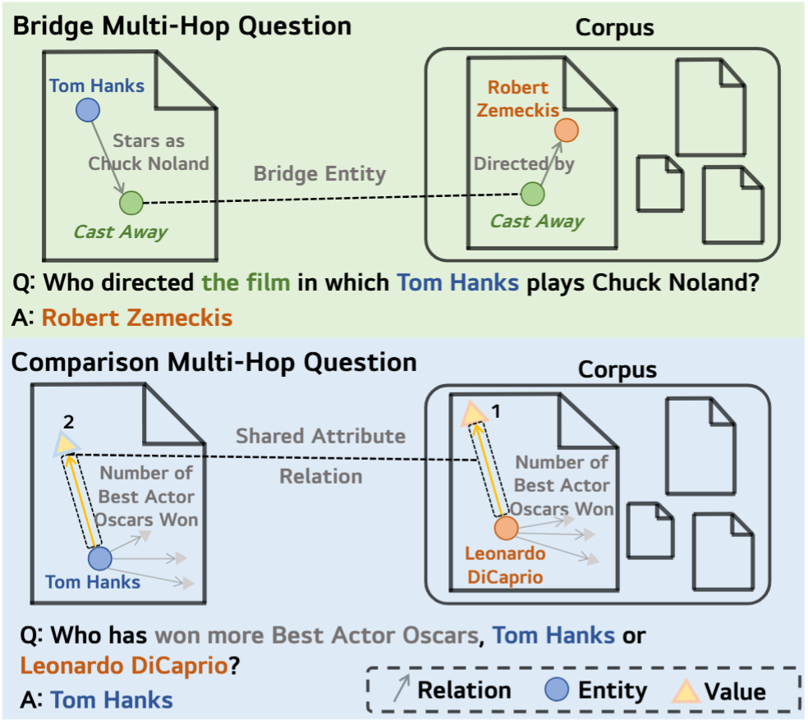

<div align="center">

# 🧵 HopWeaver: Synthesizing Authentic Multi-Hop Questions Across Text Corpora

<p><strong>首个基于非结构化文本语料库进行跨文档多跳问题自动合成的全自动化框架，无需人工标注</strong></p>

<p align="center">
  <a href="https://arxiv.org/abs/2505.15087"></a>
  <a href="https://huggingface.co/datasets/Shenzy2/HopWeaver_Data"></a>
  <a href="https://www.modelscope.cn/datasets/szyszy/HopWeaver_Data"></a>
  <a href="https://github.com/Zh1yuShen/HopWeaver/blob/main/LICENSE"></a>
  <a href="https://www.python.org/"></a>
</p>

## 🌟 主要特色

- **🥇 开创性成果**：首个基于非结构化语料库进行跨文档多跳问题合成的全自动框架，无需人工标注
- **💰 成本高效**：相比人工标注方法，显著降低高质量问题合成成本
- **🎯 质量保证**：三维评估体系确保真实的多跳推理能力
- **🔄 双重问题类型**：桥接问题（实体连接）和比较问题（属性分析）
- **📊 实证验证**：合成问题质量媲美或超越人工标注数据集

---

**HopWeaver基于非结构化文本语料库自动合成真实的跨文档多跳问题，为稀缺标注资源的专业领域提供成本效益的高质量MHQA数据集创建解决方案。**

[English](README.md) | [中文](README_CN.md)



</div>

## 📋 目录

- [🔎 项目概述](#-项目概述)
- [🏗️ 系统架构](#-系统架构)
- [🔧 核心功能模块](#-核心功能模块)
- [🔄 重排模型训练](#-重排模型训练)
- [📚 使用指南](#-使用指南)
  - [🛠️ 环境与数据准备](#-环境与数据准备)
  - [⚙️ 配置文件](#-配置文件)
  - [❓ 问题合成与评估](#-问题合成与评估)
  - [LLM-as-Judge的自一致性评估](#llm-as-judge的自一致性评估)
- [📝 示例](#-示例)
  - [桥接问题示例](#桥接问题示例)
  - [比较问题示例](#比较问题示例)
- [📜 引用](#-引用)
- [🔐 许可证](#-许可证)

## 🔎 项目概述

HopWeaver系统基于FlashRAG框架构建，专门用于合成和评估高质量的多跳问题。系统包含两个主要的问题合成路径：

1. **桥接问题合成**: 通过提取实体并建立它们之间的连接，合成需要多步推理的问题
2. **比较问题合成**: 合成需要比较多个实体特征的问题


## 🏗️ 系统架构

整个系统由以下核心组件组成：

```
HopWeaver/
├── datasets/              # 数据集目录（包含hotpotqa、2wiki、musique等数据集）
├── fig/                   # 文档图片目录
├── flashrag/              # FlashRAG框架基础代码
│   ├── config/            # 基础配置模块
│   ├── dataset/           # 数据集处理模块
│   ├── generator/         # 生成器模块
│   ├── retriever/         # 检索器模块
│   ├── evaluator/         # 评估器模块
│   └── utils/             # 通用工具函数
│
├── hopweaver/             # HopWeaver核心代码
│   ├── components/        # 主要组件
│   │   ├── bridge/        # 桥接问题组件
│   │   ├── compare/       # 比较问题组件
│   │   └── utils/         # 通用工具函数
│   ├── config_lib/        # 配置文件目录
│   ├── evaluation_system/ # 评估系统
│   └── train_reranker/    # 重排模型训练工具
│
└── requirements.txt       # 项目依赖配置
```

HopWeaver部分功能依赖于FlashRAG框架，其中，`flashrag`目录包含基础框架代码（包含了微小改动），而`hopweaver`目录则包含为多跳问答合成、评估的特定组件和功能。

## 🔧 核心功能模块

### 1. 桥接问题合成流程

桥接问题合成包含以下关键步骤：

- **🔍 桥接实体识别**：从随机选取的源文档中，系统识别可以连接不同信息上下文的桥接实体，为多跳推理提供关键枢纽
  
- **🔄 两阶段粗到细检索**：
  - 🔎 粗粒度检索：使用修改版最大边际相关性算法，平衡查询相关性、与源文档的差异性和已选文档间的多样性
  
    **📊 多样性检索评分函数：**
    
    多样性检索使用修改版最大边际相关性（MMR）算法：
    
    $$\text{Score}(d_i) = \lambda_1 \cdot \text{sim}(q, d_i) - \lambda_2 \cdot \text{sim}(d_i, d_s) - \lambda_3 \cdot \max_{d_j \in S} \text{sim}(d_i, d_j)$$
    
    其中：
    - $q$ 是查询
    - $d_i$ 是候选文档
    - $d_s$ 是源文档  
    - $S$ 是已选文档集合
    - $\text{sim}(\cdot, \cdot)$ 表示余弦相似度
    - $\lambda_1, \lambda_2, \lambda_3$ 为权重参数，满足 $\lambda_1 + \lambda_2 + \lambda_3 = 1$
    
    此公式被 **diverse** 和 **rerank** 检索方法在粗检索阶段共同使用。
  
  - 🔝 细粒度重排序：使用经过对比学习微调的重排模型，进一步优化候选文档的排序

- **🏗️ 多跳问题构建**：
  - 📝 子问题合成：分别从源文档和补充文档合成子问题，以桥接实体为中心
  - 🔄 问题合成：将子问题融合为单一连贯的多跳问题，隐含推理路径而不直接暴露桥接实体
  - ✅ 验证与迭代：确保问题满足可回答性、多跳性和无捷径约束

### 2. 比较问题合成流程

比较问题合成遵循以下步骤：

- **🧩 实体与属性识别**：从文档中识别主要实体及其3-5个简洁的事实属性值对，筛选出适合比较的属性

- **🔍 筛选与查询合成**：
  - ✓ 确保实体和属性的具体性与可比性
  - 🔎 根据源实体合成检索查询，采用直接推荐或多样化搜索策略

- **❓ 问题构建**：
  - 🎯 引导式比较：针对特定实体和属性进行精确比较
  - 🔍 开放式发现：在多个属性中寻找第一个有效的可比对
  - 📝 合成包含两个实体信息的比较问题，如"哪个实体的属性值更高/更早/更大？"

### 3. ✨ 问题润色与质量保证

在桥接和比较问题合成过程中，系统实施严格的质量控制机制：

- **🔍 问题润色与验证模块**：
  - 📊 评估问题的可回答性、多跳性和语言质量
  - 🏷️ 根据评估结果分类为通过、调整、重构或拒绝四种结果
  - ✅ 确保每个问题涉及跨文档推理并隐藏桥接实体
  - 📝 维持流畅性，不暴露中间推理步骤

### 4. 🔄 重排模型训练与优化

系统通过模拟关键步骤合成监督信号，提高检索质量：

- **📊 模拟反馈合成**：
  - 📥 从桥接问题合成过程中提取成功和失败的文档样例
  - 🔄 构建对比训练三元组(查询、正例文档、负例文档)

- **📈 对比学习优化**：
  - 🧮 使用交叉熵损失函数指导模型区分互补文档
  - 📊 直接从下游任务成功率中获取监督信号

### 5. 📏 多维度评估系统

系统采用全面的评估框架，确保合成问题的质量：

- **🤖 LLM-as-Judge评估**：
  - ⭐ 使用大型语言模型作为评判，采用李克特量表评估每个问题
  - 🔄 实现自一致性评估方法，确保评估结果的稳定性和可重现性
  - 📊 通过多次重复评估同一输入，分析评估结果的一致性

- **📋 可回答性和难度评估**：
  - 🔍 **Q-Only条件**：求解器仅接收问题，测试问题的基线可回答性，主要依赖求解器的内部知识和推理能力
  - 📚 **Q+Docs条件**：求解器接收问题及所有支撑文档，模拟黄金检索场景，评估问题在获得必要证据时的可回答性
  - 📈 **性能差异分析**：通过Q-Only到Q+Docs的性能提升来判断问题是否具有挑战性，需要跨文档推理而非仅依赖预训练知识

- **🔎 证据可获取性评估**：
  - 📊 **检索质量评估**：使用多种检索方法获取top-k文档，评估合成问题的证据在语料库中的可获取程度
  - 📏 **多维检索指标**：记录MAP（平均精度）、RECALL@k（前k召回率）、NDCG@k（归一化折扣累积增益）和Support F1等指标
  - ✅ **证据完整性验证**：确保合成的问题具有完整的证据支撑，避免无法回答的问题进入最终数据集

## 🔄 重排模型训练

项目包含专门的重排模型训练系统，用于优化文档检索结果的排序：

- 📊 对比学习数据合成
- ⚡ 基于DeepSpeed的训练
- 🧪 重排模型消融实验

## 📚 使用指南

### 🛠️ 环境与数据准备

在开始使用 HopWeaver 之前，您需要完成以下准备工作：

#### 1. 克隆代码库并安装依赖

```bash
git clone https://github.com/Zh1yuShen/HopWeaver.git
cd HopWeaver
pip install -r requirements.txt
```

#### 2. 配置 LLM API

在使用系统之前，您需要在配置文件中配置 LLM API。检查并修改 `config_lib/example_config.yaml`，重点关注以下关键设置：

```yaml
# API 类型选择（openai, azure, openrouter, anthropic, local）
api_type: "openai"

# OpenAI 设置
openai_setting:
  api_keys:
    - "your-openai-api-key-1"
    - "your-openai-api-key-2"
    - "your-openai-api-key-3"

# 模型选择
generator_model: "gpt-4o"
entity_extractor_model: "gpt-4o"
question_generator_model: "gpt-4o"
polisher_model: "gpt-4o"
filter_model: "gpt-4o"
```

> **注意**：根据您使用的模型类型，您可能需要修改 `HopWeaver/flashrag/generator/openai_generator.py` 文件中的参数设置和 API 选择逻辑。例如，如果您想使用 Google 的 Gemini 模型，您需要在 `openai_generator.py` 中添加类似以下的代码：
> 
> ```python
> # 检测模型类型并选择对应的配置
> if "gemini" in self.model_name.lower():
>     self.openai_setting = config["google_setting"]
> elif "claude" in self.model_name.lower():
>     self.openai_setting = config["anthropic_setting"]
> # 其他模型类型判断...
> else:
>     self.openai_setting = config["openai_setting"]
> ```
> 
> 同时，不同模型（如 GPT-4、Claude、Qwen、DeepSeek 等）可能需要不同的参数配置，如 temperature、top_p、max_tokens 等。请根据您选择的模型特性进行相应调整。

##### 🤖 模型选择建议

HopWeaver 由几个可以使用不同模型的组件组成。以下是基于我们实验的建议：

- **polisher_model**：我们建议为语言润色组件使用 DeepSeek-R1 或更高级的模型，因为它需要强大的语言优化能力
- **其他组件**：您可以为其他组件（entity_extractor, question_generator, filter 等）使用相同的模型。我们建议为所有合成组件选择同一个模型。在我们的论文中，我们成功测试了各种模型，包括：
  - QwQ-32B
  - Qwen3-14B
  - GLM-9B-0414

为了获得最佳性能，我们建议使用至少 7B 参数的模型。较小的模型可能难以处理多跳问题合成所需的复杂推理。

##### 💻 本地模型配置

您可以使用[FlashRAG](https://github.com/RUC-NLPIR/FlashRAG)提供的本地模型支持，它支持多种本地模型部署方式

##### ⚡ API调用优化

HopWeaver实现了如下优化机制，提高了API调用的稳定性和效率：

1. **🔄 多个API Key轮询**: 当配置多个API Key时，系统会自动轮询使用，分散请求率限制

   ```yaml
   openai_setting:
     api_keys:
       - "key1"
       - "key2"
       - "key3"  # 多个API Key列表
   ```

2. **🔄 错误自动重试**: 当遇到常见API错误(如速率限制、服务器错误)时，系统会自动重试

3. **⚡ 异步请求处理**: 支持批量异步请求，最大化利用API调用频率

这些机制使得HopWeaver在面对大量多跳问题合成时，能更高效地利用LLM API资源。

#### 3. 多API提供商支持

HopWeaver支持多种API提供商，提供更强的灵活性和冗余能力。您可以在配置文件中配置不同的提供商：

```yaml
# 多API提供商配置
api_type: "openai"  # 主要API类型

# OpenAI 配置
openai_setting:
  api_keys:
    - "your-openai-api-key-1"
    - "your-openai-api-key-2"
  base_url: "https://api.openai.com/v1"

# Google Gemini 配置
gemini_setting:
  api_keys:
    - "your-gemini-api-key-1"
    - "your-gemini-api-key-2"
  base_url: "https://generativelanguage.googleapis.com/v1"

# DeepSeek 配置
deepseek_setting:
  api_key: "your-deepseek-api-key"
  base_url: "https://api.deepseek.com/v1"

# Claude (Anthropic) 配置
claude_setting:
  api_key: "your-claude-api-key"
  base_url: "https://api.anthropic.com"

# OpenRouter 配置（支持多种模型）
openrouter_setting:
  api_keys:
    - "your-openrouter-key-1"
    - "your-openrouter-key-2"
  base_url: "https://openrouter.ai/api/v1"

# GLM (SiliconFlow) 配置
GLM_setting:
  api_keys: "your-glm-api-key"
  base_url: "https://api.siliconflow.cn/v1"
```

**各提供商支持的模型：**
- **OpenAI**: GPT-4o, GPT-4-turbo, GPT-3.5-turbo 等
- **Google**: Gemini-2.0-flash, Gemini-2.5-flash-preview 等
- **DeepSeek**: DeepSeek-R1, DeepSeek-V3 等
- **Claude**: Claude-3.5-Sonnet 等
- **OpenRouter**: 可访问 QwQ-32B, Gemma-3-27B 等模型
- **GLM**: GLM-4-9B 和其他 SiliconFlow 支持的模型

#### 4. 全局路径映射配置

HopWeaver使用全局路径映射来高效管理模型路径、索引和语料库：

```yaml
# 全局路径映射
model2path:
  e5: "/path/to/e5-base-v2"
  gte: "/path/to/gte_sentence-embedding_multilingual-base"

# 各嵌入模型的池化方法
model2pooling:
  e5: "mean"
  gte: "cls"

# 检索模型的索引路径
method2index:
  e5: '/path/to/e5_Flat.index'
  gte: '/path/to/gte_Flat.index'
  bm25: ~
  contriever: ~

# 不同方法的语料库路径
method2corpus:
  e5: '/path/to/wiki18_fulldoc_trimmed_4096.jsonl'
  gte: '/path/to/wiki18_fulldoc_trimmed_4096.jsonl'
```

**配置优势：**
- **集中管理**：所有模型和数据路径集中在一个位置
- **便捷切换**：通过修改 `retrieval_method` 参数即可切换检索方法
- **自动解析**：系统根据方法选择自动解析对应路径
- **可扩展性**：易于添加新的模型和语料库

#### 5. 检索器高级参数

为了精细控制检索过程，可配置以下高级参数：

**📊 检索方法选择：**

HopWeaver支持三种检索方法：
- **standard**：标准检索，仅基于查询相关性排序
- **diverse**：多样性检索，使用MMR算法平衡相关性和多样性
- **rerank**：两阶段检索，先进行多样性检索，再使用训练好的重排模型精细排序

```yaml
# 检索器配置
retriever_type: "rerank"  # 检索方法选择，选项："standard"、"diverse" 或 "rerank"
reranker_path: "/path/to/trained/reranker/model"  # 重排模型路径（仅在rerank方法时需要）

# 检索器多样性权重参数（适用于diverse和rerank方法的粗检索阶段）
lambda1: 0.87  # 查询相关性权重 (0-1)
lambda2: 0.03  # 原始文档多样性权重 (0-1)
lambda3: 0.1   # 已选文档多样性权重 (0-1)

# 性能参数
use_fp16: true              # 使用FP16加速
query_max_length: 512       # 查询最大长度
passage_max_length: 8196    # 文档最大长度
reranker_batch_size: 16     # 重排批处理大小（仅rerank方法）
reranker_normalize: false   # 是否标准化重排分数（仅rerank方法）
reranker_devices: ["cuda:0"] # 重排使用的设备（仅rerank方法）

# 检索缓存（性能优化）
save_retrieval_cache: false    # 保存检索结果到缓存
use_retrieval_cache: false     # 使用缓存的检索结果
retrieval_cache_path: ~        # 检索缓存文件路径
```

**参数调优指南：**
- **lambda1 (0.8-0.9)**：更高的值优先考虑查询-文档相关性
- **lambda2 (0.05-0.15)**：控制与源文档的多样性
- **lambda3 (0.05-0.15)**：控制已选文档间的多样性
- **lambda1+lambda2+lambda3 的和应等于 1.0**

**性能提示：**
- 使用 `use_fp16: true` 可以获得更快的推理速度，质量损失极小
- 根据GPU内存调整 `reranker_batch_size`
- 对于重复实验相同查询，启用缓存可提高效率

#### 6. 下载Wiki数据集

您需要下载`wiki18_fulldoc_trimmed_4096.jsonl`数据文件，这是我们预处理好的Wiki数据集，包含截取了文档长度小于4096的Wiki文章。

数据集下载链接: [huggingface](https://huggingface.co/datasets/Shenzy2/HopWeaver_Data) or [modelscope](https://www.modelscope.cn/datasets/szyszy/HopWeaver_Data)

对于我们论文中比较的HotpotQA、2wiki、musique的步骤，可以将下载的数据集放入 datasets 文件夹中，并且用 datasets/process_and_sample_datasets.py 处理这些采样出任意样本，用于后续比较。

**数据格式说明**：
`wiki18_fulldoc_trimmed_4096.jsonl`是JSONL格式文件，每行包含一个JSON对象，结构如下：
```json
{
  "id": "591775",
  "title": "Los Ramones",
  "doc_size": 1250,
  "contents": "Los Ramones\nLos Ramones Los Ramones is the name of a municipality..."
}
```

**字段说明**：
- `id`: 文档的唯一标识符
- `title`: 文档标题
- `doc_size`: 文档内容的字符长度
- `contents`: 文档的完整正文内容

#### 7. 下载GTE嵌入模型

HopWeaver使用[GTE](https://huggingface.co/iic/gte_sentence-embedding_multilingual-base)多语言模型进行检索。您可以直接从Hugging Face下载该模型，并在配置文件中指定路径：

修改配置文件`config_lib/example_config.yaml`中的模型路径：
```yaml
model2path:
  gte: "您下载的GTE模型路径"
```

#### 8. 下载或构建索引

您可以选择下载我们预构建好的索引文件(
 [huggingface](https://huggingface.co/datasets/Shenzy2/HopWeaver_Data) or [modelscope](https://www.modelscope.cn/datasets/szyszy/HopWeaver_Data))，或自行构建：

```bash
# 创建索引保存目录
mkdir -p index

# 下载预构建索引（推荐）
# 索引下载链接: [INDEX_DOWNLOAD_LINK_PLACEHOLDER]

# 或者使用FlashRAG构建索引
python -m flashrag.build_index \
  --model_name_or_path 您下载的GTE模型路径 \
  --corpus_path dataset/wiki18_fulldoc_trimmed_4096.jsonl \
  --index_path index/gte_Flat.index \
  --batch_size 32 \
  --model_type gte \
  --pooling_method cls \
  --use_fp16
```

参数说明：
- `--model_name_or_path`: GTE模型路径
- `--corpus_path`: Wiki语料库文件路径
- `--index_path`: 生成的索引保存路径
- `--batch_size`: 批处理大小，可根据您的GPU内存调整
- `--model_type`: 模型类型，这里是gte
- `--pooling_method`: 池化方法，GTE使用cls
- `--use_fp16`: 使用FP16以加速索引构建

### ⚙️ 配置文件

项目使用YAML格式的配置文件。主要配置项包括：

- 语料库路径
- 模型选择和参数
- 数据处理选项
- GPU设备分配

完成上述准备工作后，您就可以开始使用HopWeaver合成多跳问题了。

### ❓ 问题合成与评估

#### 桥接问题合成

```bash
# 合成并评估桥接问题（基础）
python -m hopweaver.generate_and_evaluate_bridge --config ./config_lib/bridge_default_config.yaml


# 使用重排序检索器和自定义权重合成桥接问题
python -m hopweaver.generate_and_evaluate_bridge --config ./config_lib/bridge_default_config.yaml --retriever rerank --count 50 --name test_rerank --lambda1 0.87 --lambda2 0.03 --lambda3 0.1

# 使用自定义配置文件合成桥接问题
python -m hopweaver.generate_and_evaluate_bridge --config ./config_lib/your_custom_config.yaml --count 20 --name custom_test

# 仅评估现有的桥接问题数据集
python -m hopweaver.generate_and_evaluate_bridge --config ./config_lib/bridge_default_config.yaml --eval-only --dataset-path ./datasets/bridge_questions.json
```

#### 比较问题合成

```bash
# 合成并评估比较问题（基础）
python -m hopweaver.generate_and_evaluate_comparison --config ./config_lib/example_config.yaml

# 使用特定名称前缀合成30个比较问题
python -m hopweaver.generate_and_evaluate_comparison --config ./config_lib/example_config.yaml --count 30 --name test_comparison

# 使用自定义配置文件和输出目录合成比较问题
python -m hopweaver.generate_and_evaluate_comparison --config ./config_lib/your_custom_config.yaml --count 50 --name test_comparison --output-dir ./output_comparison

# 仅评估现有的比较问题数据集
python -m hopweaver.generate_and_evaluate_comparison --config ./config_lib/example_config.yaml --eval-only --dataset-path ./datasets/comparison_questions.json
```

#### 仅生成模式（不进行评估）

如果您只想合成问题而不进行评估，可以使用独立的问题合成器：

**仅生成桥接问题：**

```bash
# 仅生成桥接问题，不进行评估
python -m hopweaver.bridge_question_synthesizer --config ./config_lib/example_config.yaml --count 10

# 使用重排检索器生成
python -m hopweaver.bridge_question_synthesizer --config ./config_lib/example_config.yaml --count 15 --retriever rerank

# 使用自定义参数和重排检索器生成
python -m hopweaver.bridge_question_synthesizer --config ./config_lib/example_config.yaml --count 20 --retriever rerank --lambda1 0.87 --lambda2 0.03 --lambda3 0.1

# 使用多样性检索器生成（默认）
python -m hopweaver.bridge_question_synthesizer --config ./config_lib/example_config.yaml --count 10 --retriever diverse
```

**仅生成比较问题：**

```bash
# 仅生成比较问题，不进行评估
python -m hopweaver.comparison_question_synthesizer --config ./config_lib/example_config.yaml --count 10

# 使用重排检索器生成
python -m hopweaver.comparison_question_synthesizer --config ./config_lib/example_config.yaml --count 15 --retriever rerank

# 使用自定义输出目录和重排检索器生成
python -m hopweaver.comparison_question_synthesizer --config ./config_lib/example_config.yaml --count 20 --output-dir ./my_output --retriever rerank

# 使用特定名称前缀和多样性检索器生成
python -m hopweaver.comparison_question_synthesizer --config ./config_lib/example_config.yaml --count 15 --name my_comparison_test --retriever diverse
```

#### 参数说明

- `--config`: 配置文件路径（默认：./config_lib/example_config.yaml）
- `--count`: 要合成的问题数量（默认：10）
- `--name`: 数据集名称前缀，用于区分不同的合成批次
- `--retriever`: 检索器类型，选项：'standard'、'diverse'或'rerank'（默认：'diverse'）
- `--eval-only`: 仅评估现有问题，不合成新问题
- `--dataset-path`: 要评估的数据集路径（仅在eval-only为True时使用）
- `--lambda1`: 查询相关性权重（0到1，默认：0.8），值越高越强调文档-查询相关性
- `--lambda2`: 原始文档多样性权重（0到1，默认：0.1），值越高越强调与源文档的多样性
- `--lambda3`: 已选文档多样性权重（0到1，默认：0.1），值越高越强调已选文档之间的多样性


### LLM-as-Judge的自一致性评估

```bash
# 基础自一致性评估
python -m hopweaver.judge_evaluation_self_con --config ./config_lib/example_config.yaml

# 使用自定义参数进行自一致性评估
python -m hopweaver.judge_evaluation_self_con \
  --config ./config_lib/example_config.yaml \
  --bridge ./datasets/bridge_questions.json \
  --comparison ./datasets/comparison_questions.json \
  --num_samples 20 \
  --repeats 5 \
  --output_dir ./eval_result/custom_stability \
  --max_workers 1

# 仅对特定模型进行评估
python -m hopweaver.judge_evaluation_self_con \
  --models "gpt-4o-2024-11-20,claude-3-7-sonnet-20250219,gemini-2.0-flash"

# 仅执行可视化和指标计算（不进行新的评估）
python -m hopweaver.judge_evaluation_self_con --results_dir ./eval_result/stability/20250521_123456
```#### 参数说明

- `--config`: 配置文件路径（默认：./config_lib/example_config.yaml）
- `--bridge`: 桥接类型数据集路径（默认：./datasets/2wiki_bridge.json）
- `--comparison`: 比较类型数据集路径（默认：./datasets/2wiki_comparison.json）
- `--num_samples`: 每种类型选择的样本数量（默认：25）
- `--repeats`: 每个样本的评估重复次数（默认：5）
- `--output_dir`: 输出目录（默认：./eval_result/stability）
- `--max_workers`: 最大并行工作线程数（默认：1）
- `--test`: 测试模式，每个模型只评估一个样本（标志参数）
- `--results_dir`: 现有评估结果目录，仅执行可视化和指标计算
- `--models`: 要评估的模型列表（逗号分隔）
```
## 📝 示例

### 桥接问题示例


<details>
<summary>点击展开详细说明</summary>

#### 1. 源文档和目标文档内容

**Document A - 解剖学领域文档**  
标题: Crus of diaphragm (膈肌脚)

全文内容：
> Crus of diaphragm\nCrus of diaphragm The crus of diaphragm (pl. crura), refers to one of two tendinous structures that extends below the diaphragm to the vertebral column. There is a right crus and a left crus, which together form a tether for muscular contraction. They take their name from their leg-shaped appearance – "crus" meaning "leg" in Latin. The crura originate from the front of the bodies and intervertebral fibrocartilage of the lumbar vertebrae. They are tendinous and blend with the anterior longitudinal ligament of the vertebral column. The medial tendinous margins of the crura pass anteriorly and medialward, and meet in the middle line to form an arch across the front of the aorta known as the median arcuate ligament; this arch is often poorly defined. The area behind this arch is known as the aortic hiatus. From this series of origins the fibers of the diaphragm converge to be inserted into the central tendon. The fibers arising from the xiphoid process are very short, and...

核心摘要：
描述了膈肌脚的解剖结构，特别是左右膈肌脚的内侧腱性边缘如何在主动脉前方汇合形成正中弓状韧带 (Median Arcuate Ligament)，并构成主动脉裂孔。

**Document B - 病理学领域文档**  
标题: Median arcuate ligament syndrome (正中弓状韧带综合征)

全文内容：
> Median arcuate ligament syndrome\nMedian arcuate ligament syndrome In medicine, the median arcuate ligament syndrome (MALS, also known as celiac artery compression syndrome, celiac axis syndrome, celiac trunk compression syndrome or Dunbar syndrome) is a condition characterized by abdominal pain attributed to compression of the celiac artery and the celiac ganglia by the median arcuate ligament. The abdominal pain may be related to meals, may be accompanied by weight loss, and may be associated with an abdominal bruit heard by a clinician. The diagnosis of MALS is one of exclusion, as many healthy patients demonstrate some degree of celiac artery compression in the absence of symptoms. Consequently, a diagnosis of MALS is typically only entertained after more common conditions have been ruled out. Once suspected, screening for MALS can be done with ultrasonography and confirmed with computed tomography (CT) or magnetic resonance (MR) angiography. Treatment is generally surgical, the mai...

核心摘要：
定义了正中弓状韧带综合征 (MALS)，指出该病症是由于正中弓状韧带压迫腹腔动脉和腹腔神经节所致，常伴有腹痛、体重减轻等症状。

---

#### 2. 桥梁实体 (Bridge Entity) 及其作用

- 桥梁实体名称：**Median Arcuate Ligament (正中弓状韧带)**
- 类型：Structure (解剖结构)
- 连接作用：
    - 文档A详细描述了"正中弓状韧带"是如何由膈肌脚形成的解剖结构。
    - 文档B阐述了这个"正中弓状韧带"在特定情况下如何导致临床病症（MALS）。
    - 因此，"正中弓状韧带"作为核心的解剖结构，在两个文档之间建立了从"是什么"（解剖构成）到"会怎样"（临床影响）的桥梁。

---

#### 3. 子问题构建与推理分析

**推理逻辑连接：**  
正中弓状韧带的解剖结构（源自文档A）与其压迫腹腔动脉导致正中弓状韧带综合征（MALS）的病理生理机制（源自文档B）直接相关。

**子问题示例：**

- 子问题1（源自文档A）：  
  问题：膈肌脚的内侧腱性边缘在主动脉前方中线汇合形成的弓形结构是什么？  
  答案：正中弓状韧带 (Median arcuate ligament)  
  来源：文档 A

- 子问题2（源自文档B）：  
  问题：当正中弓状韧带压迫腹腔动脉和神经节时，会导致什么综合征？  
  答案：正中弓状韧带综合征 (Median arcuate ligament syndrome)  
  来源：文档 B

**推理路径：**  
文档A阐明了正中弓状韧带的解剖学起源（由膈肌脚形成，构成主动脉裂孔），为其提供了结构基础。文档B则解释了这一结构如何可能在病理情况下压迫腹腔动脉和神经节，从而引发MALS。

---

#### 4. 多跳对比问题合成

**多跳问题：**  
问题：当膈肌脚在主动脉处汇合形成的解剖结构压迫腹腔动脉和神经节时，会引起什么综合征？  
答案：正中弓状韧带综合征 (Median arcuate ligament syndrome)

**推理路径：**  
- 文档A确定了"正中弓状韧带"是膈肌脚在主动脉处汇合形成的解剖结构，并构成主动脉裂孔。
- 文档B阐述了该韧带对腹腔动脉和神经节的病理性压迫会导致"正中弓状韧带综合征"。
- 问题要求识别文档A中的解剖结构，并理解其在文档B中描述的临床后果，两者通过隐含的结构关系联系起来。

---

#### 5. 结构化示例小结

此示例展示了如何连接描述解剖学基础知识的文档和描述相关临床病症的文档，通过关键的桥梁实体（正中弓状韧带），构建出需要多步推理才能解答的复杂问题。这不仅考察了对单个文档信息的理解，更考察了综合不同来源信息并进行逻辑推理的能力。

</details>

---

### 比较问题示例


<details>
<summary>点击展开详细说明</summary>

#### 1. 源文档与目标文档内容提取

**源文档（Composer Biography Snippet）：**  
Mihály Mosonyi（1815年9月4日出生于奥匈帝国Boldogasszony，1870年10月31日逝世于布达佩斯）是一位匈牙利作曲家。原名Michael Brand，后为纪念家乡Moson地区改名为Mosonyi。"Mihály"为Michael的匈牙利语形式。他致力于创作具有匈牙利民族风格的器乐作品，代表作包括《葬礼音乐》《净化节》等。

**目标文档（Composer Biography Snippet）：**  
Adam Liszt（作曲家之父）是埃斯特哈齐庄园的牧羊主管，同时也是乐手。Franz Liszt（李斯特）作为Adam Liszt与Maria Anna的独子，于1811年10月22日在Raiding出生，并于次日受洗。李斯特自六岁起由父亲教授音乐，后举家迁往维也纳，李斯特成为19世纪最著名的匈牙利作曲家之一。

---

#### 2. 文档之间的联系

- 两个文档都提供了各自作曲家的出生日期及其早期生平信息。
- 通过"出生日期"这一属性，可以建立起直接的对比关系。

---

#### 3. 多跳推理路径构建

**推理路径：**  
- 信息提取（文档A）：识别到Mihály Mosonyi的出生日期为1815年9月4日。
- 信息提取（文档B）：识别到Franz Liszt的出生日期为1811年10月22日。
- 比较分析：将两个日期进行对比，发现1811年早于1815年。
- 多跳问题构建：基于上述推理链，提出"哪位作曲家的出生日期更早"这一对比型问题。

---

#### 4. 最终多跳对比问题示例

**问题：**  
哪位作曲家的出生日期更早：Mihály Mosonyi 还是 Franz Liszt？

**答案：**  
Franz Liszt

</details>

## 📜 引用

如果您在研究中使用了HopWeaver，请引用我们的工作：

```bibtex
@misc{shen2025hopweaversynthesizingauthenticmultihop,
      title={HopWeaver: Synthesizing Authentic Multi-Hop Questions Across Text Corpora}, 
      author={Zhiyu Shen and Jiyuan Liu and Yunhe Pang and Yanghui Rao},
      year={2025},
      eprint={2505.15087},
      archivePrefix={arXiv},
      primaryClass={cs.CL},
      url={https://arxiv.org/abs/2505.15087}, 
}
```

## 🔐 许可证

本项目基于MIT许可证授权 - 详见[LICENSE](LICENSE)文件。


