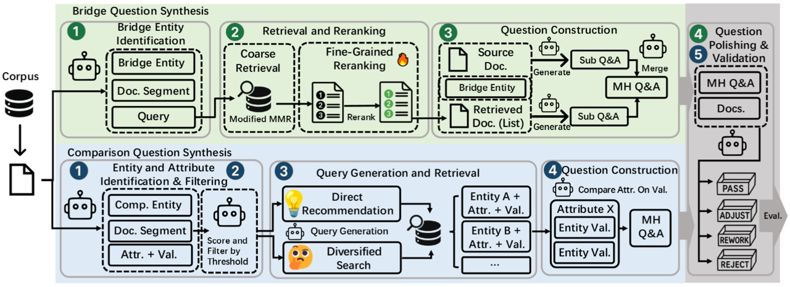
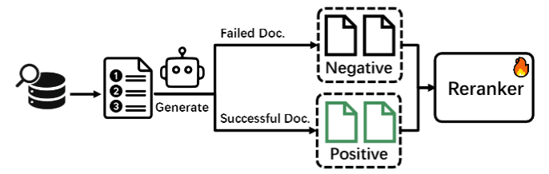
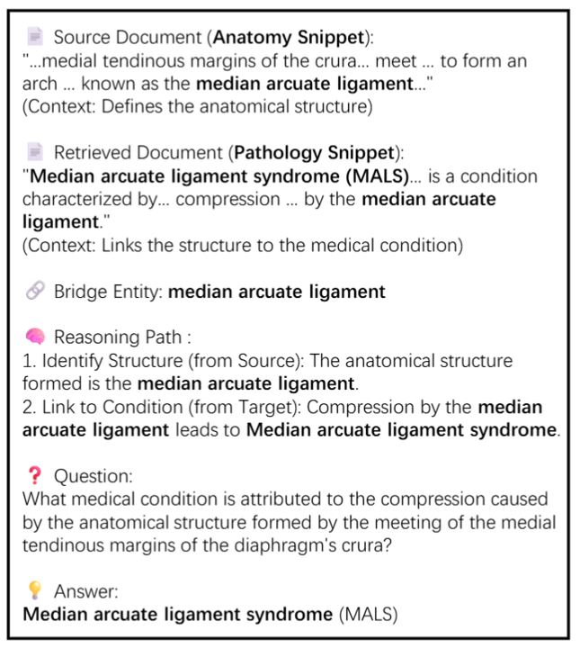

<div align="center">

# 🧵 HopWeaver: Synthesizing Authentic Multi-Hop Questions Across Text Corpora

<p><strong>首个基于非结构化文本语料库进行跨文档多跳问题自动合成的全自动化框架，无需人工标注</strong></p>

<p align="center">
  <a href="https://arxiv.org/abs/2505.15087"></a>
  <a href="https://huggingface.co/datasets/Shenzy2/HopWeaver_Data"></a>
  <a href="https://www.modelscope.cn/datasets/szyszy/HopWeaver_Data"></a>
  <a href="https://github.com/Zh1yuShen/HopWeaver/blob/main/LICENSE"></a>
  <a href="https://www.python.org/"></a>
</p>

## 🌟 主要特色

- **🥇 开创性成果**：首个基于非结构化语料库进行跨文档多跳问题合成的全自动框架，无需人工标注
- **💰 成本高效**：相比人工标注方法，显著降低高质量问题合成成本
- **🎯 质量保证**：三维评估体系确保真实的多跳推理能力
- **🔄 双重问题类型**：桥接问题（实体连接）和比较问题（属性分析）
- **📊 实证验证**：合成问题质量媲美或超越人工标注数据集

---

**HopWeaver基于非结构化文本语料库自动合成真实的跨文档多跳问题，为稀缺标注资源的专业领域提供成本效益的高质量MHQA数据集创建解决方案。**

[English](README.md) | [中文](README_CN.md)



</div>

## 📋 目录

- [🚀 快速开始](#-快速开始)
- [🔎 项目概述](#-项目概述)
- [🏗️ 系统架构](#-系统架构)
- [🔧 核心功能模块](CORE_MODULES_CN.md)
- [🔄 重排模型训练](#-重排模型训练)
- [📚 使用指南](#-使用指南)
  - [🛠️ 环境与数据准备](ENVIRONMENT_SETUP_CN.md)
  - [❓ 问题合成与评估](#-问题合成与评估)
  - [LLM-as-Judge的自一致性评估](#llm-as-judge的自一致性评估)
- [📝 示例](#-示例)
  - [桥接问题示例](#桥接问题示例)
  - [比较问题示例](#比较问题示例)
- [📜 引用](#-引用)
- [🔐 许可证](#-许可证)

## 🚀 快速开始

本节提供一个最简化的指南，帮助您快速运行HopWeaver并生成少量示例问题。更详细的配置请参考 [📚 使用指南](#-使用指南) 部分。

1.  **克隆代码库并安装依赖:**
    ```bash
    git clone https://github.com/Zh1yuShen/HopWeaver.git
    cd HopWeaver
    pip install -r requirements.txt
    ```

2.  **准备核心数据与模型:**
    *   **下载预处理的Wiki数据集:** 从 [Hugging Face](https://huggingface.co/datasets/Shenzy2/HopWeaver_Data) 或 [ModelScope](https://www.modelscope.cn/datasets/szyszy/HopWeaver_Data) 下载 `wiki18_fulldoc_trimmed_4096.jsonl` 文件。
    *   **下载GTE嵌入模型:** 从 [Hugging Face](https://huggingface.co/iic/gte_sentence-embedding_multilingual-base) 下载 GTE 模型（通常是一个包含多个文件的文件夹）。
    *   **下载预构建的FAISS索引:** 从 [Hugging Face](https://huggingface.co/datasets/Shenzy2/HopWeaver_Data) 或 [ModelScope](https://www.modelscope.cn/datasets/szyszy/HopWeaver_Data) 下载预构建的 `gte_Flat.index` 文件 (推荐)。

3.  **配置API和路径:**
    *   复制 `config_lib/example_config.yaml` 并重命名为例如 `config_lib/my_quickstart_config.yaml` (或者，您可以直接修改 `example_config.yaml`，但不推荐用于保留原始示例)。
    *   **LLM API密钥和模型配置:**
        在您的配置文件中（例如 `my_quickstart_config.yaml`）设置LLM API密钥。系统会依据您在YAML中指定的 `generator_model` 名称内的关键字，来选择对应的API设置块（如 `openai_setting`, `google_setting`）。
        请确保您选择的 `generator_model` 与YAML中正确配置的 `*_setting` 块相对应，并包含 `api_keys` 和 `base_url`。

        例如，若设置 `generator_model: "gpt-4o"`，则会使用 `openai_setting`:
        ```yaml
        # OpenAI 设置 (若模型名称暗示为OpenAI，或默认情况下使用)
        openai_setting:
          api_keys:
            - "YOUR_OPENAI_API_KEY" # <--- 设置您的OpenAI密钥
          base_url: "https://api.openai.com/v1"

        # 若需要，可定义其他设置（如 google_setting, anthropic_setting），
        # 确保它们与您选择的 generator_model匹配。例如：
        # google_setting:
        #   api_key: "YOUR_GOOGLE_API_KEY"
        #   base_url: "https://generativelanguage.googleapis.com/v1"
        # anthropic_setting:
        #   api_key: "YOUR_ANTHROPIC_API_KEY"
        #   base_url: "https://api.anthropic.com"

        # 各组件的模型选择。
        # 每个模型名称（如果其使用的生成器依赖基于关键字的设置选择逻辑，
        # 如 openai_generator.py）都决定了哪个 *_setting 配置块（例如 openai_setting, google_setting）
        # 必须已正确配置API密钥和base_url。
        generator_model: "gpt-4o"
        entity_extractor_model: "gpt-4o" # 若使用gpt-4o，请确保openai_setting已配置
        question_generator_model: "gpt-4o" # 请确保openai_setting已配置
        polisher_model: "gpt-4o"           # 请确保openai_setting已配置
        filter_model: "gpt-4o"             # 请确保openai_setting已配置
        ```
    *   **数据与模型路径:** 更新配置文件中的以下路径，指向您在步骤2中下载的文件和模型文件夹：
        ```yaml
        # 全局路径映射
        model2path:
          gte: "您下载的GTE模型文件夹的完整路径" # <--- 修改这里, 例如 /home/user/models/gte_sentence-embedding_multilingual-base

        # 各嵌入模型的池化方法 (GTE 通常使用 cls, 此处通常无需修改)
        model2pooling:
          gte: "cls"

        # 检索模型的索引路径
        method2index:
          gte: '您下载的gte_Flat.index文件的完整路径' # <--- 修改这里, 例如 /home/user/data/HopWeaver/index/gte_Flat.index

        # 不同方法的语料库路径
        method2corpus:
          gte: '您下载的wiki18_fulldoc_trimmed_4096.jsonl文件的完整路径' # <--- 修改这里, 例如 /home/user/data/HopWeaver/datasets/wiki18_fulldoc_trimmed_4096.jsonl
        ```
        *请确保将 `"YOUR_OPENAI_API_KEY"` 和 `"您下载的...的完整路径"` 替换为您的实际密钥和本地文件/文件夹的绝对路径。*

4.  **运行示例合成:**
    使用您配置好的文件（例如 `my_quickstart_config.yaml`）运行一个简单的桥接问题合成任务：
    ```bash
    python -m hopweaver.generate_and_evaluate_bridge --config ./config_lib/my_quickstart_config.yaml --count 3 --name quick_test_bridge --retriever standard
    ```
    这将会生成3个桥接问题，并将结果保存在 `output/quick_test_bridge/` 目录下。

完成以上步骤后，您应该能够成功运行HopWeaver。如需了解更多高级功能和自定义选项，请继续阅读后续的详细使用指南。

## 🔎 项目概述

HopWeaver系统基于FlashRAG框架构建，专门用于合成和评估高质量的多跳问题。系统包含两个主要的问题合成路径：

1. **桥接问题合成**: 通过提取实体并建立它们之间的连接，合成需要多步推理的问题
2. **比较问题合成**: 合成需要比较多个实体特征的问题


## 🏗️ 系统架构

整个系统由以下核心组件组成：

```
HopWeaver/
├── datasets/              # 数据集目录（包含hotpotqa、2wiki、musique等数据集）
├── fig/                   # 文档图片目录
├── flashrag/              # FlashRAG框架基础代码
│   ├── config/            # 基础配置模块
│   ├── dataset/           # 数据集处理模块
│   ├── generator/         # 生成器模块
│   ├── retriever/         # 检索器模块
│   ├── evaluator/         # 评估器模块
│   └── utils/             # 通用工具函数
│
├── hopweaver/             # HopWeaver核心代码
│   ├── components/        # 主要组件
│   │   ├── bridge/        # 桥接问题组件
│   │   ├── compare/       # 比较问题组件
│   │   └── utils/         # 通用工具函数
│   ├── config_lib/        # 配置文件目录
│   ├── evaluation_system/ # 评估系统
│   └── train_reranker/    # 重排模型训练工具
│
└── requirements.txt       # 项目依赖配置
```

HopWeaver部分功能依赖于FlashRAG框架，其中，`flashrag`目录包含基础框架代码（包含了微小改动），而`hopweaver`目录则包含为多跳问答合成、评估的特定组件和功能。

详细的核心功能模块说明，请参见 [核心功能模块指南](CORE_MODULES_CN.md)。

## 🔄 重排模型训练

项目包含专门的重排模型训练系统，用于优化文档检索结果的排序：

- 📊 对比学习数据合成
- ⚡ 基于DeepSpeed的训练
- 🧪 重排模型消融实验

## 📚 使用指南

详细的环境和数据准备说明，请参见 [环境与数据准备指南](ENVIRONMENT_SETUP_CN.md)。

### ❓ 问题合成与评估

#### 桥接问题合成

```bash
# 合成并评估桥接问题（基础）
python -m hopweaver.generate_and_evaluate_bridge --config ./config_lib/bridge_default_config.yaml


# 使用重排序检索器和自定义权重合成桥接问题
python -m hopweaver.generate_and_evaluate_bridge --config ./config_lib/bridge_default_config.yaml --retriever rerank --count 50 --name test_rerank --lambda1 0.87 --lambda2 0.03 --lambda3 0.1

# 使用自定义配置文件合成桥接问题
python -m hopweaver.generate_and_evaluate_bridge --config ./config_lib/your_custom_config.yaml --count 20 --name custom_test

# 仅评估现有的桥接问题数据集
python -m hopweaver.generate_and_evaluate_bridge --config ./config_lib/bridge_default_config.yaml --eval-only --dataset-path ./datasets/bridge_questions.json
```

#### 比较问题合成

```bash
# 合成并评估比较问题（基础）
python -m hopweaver.generate_and_evaluate_comparison --config ./config_lib/example_config.yaml

# 使用特定名称前缀合成30个比较问题
python -m hopweaver.generate_and_evaluate_comparison --config ./config_lib/example_config.yaml --count 30 --name test_comparison

# 使用自定义配置文件和输出目录合成比较问题
python -m hopweaver.generate_and_evaluate_comparison --config ./config_lib/your_custom_config.yaml --count 50 --name test_comparison --output-dir ./output_comparison

# 仅评估现有的比较问题数据集
python -m hopweaver.generate_and_evaluate_comparison --config ./config_lib/example_config.yaml --eval-only --dataset-path ./datasets/comparison_questions.json
```

#### 仅生成模式（不进行评估）

如果您只想合成问题而不进行评估，可以使用独立的问题合成器：

**仅生成桥接问题：**

```bash
# 仅生成桥接问题，不进行评估
python -m hopweaver.bridge_question_synthesizer --config ./config_lib/example_config.yaml --count 10

# 使用重排检索器生成
python -m hopweaver.bridge_question_synthesizer --config ./config_lib/example_config.yaml --count 15 --retriever rerank

# 使用自定义参数和重排检索器生成
python -m hopweaver.bridge_question_synthesizer --config ./config_lib/example_config.yaml --count 20 --retriever rerank --lambda1 0.87 --lambda2 0.03 --lambda3 0.1

# 使用多样性检索器生成（默认）
python -m hopweaver.bridge_question_synthesizer --config ./config_lib/example_config.yaml --count 10 --retriever diverse
```

**仅生成比较问题：**

```bash
# 仅生成比较问题，不进行评估
python -m hopweaver.comparison_question_synthesizer --config ./config_lib/example_config.yaml --count 10

# 使用重排检索器生成
python -m hopweaver.comparison_question_synthesizer --config ./config_lib/example_config.yaml --count 15 --retriever rerank

# 使用自定义输出目录和重排检索器生成
python -m hopweaver.comparison_question_synthesizer --config ./config_lib/example_config.yaml --count 20 --output-dir ./my_output --retriever rerank

# 使用特定名称前缀和多样性检索器生成
python -m hopweaver.comparison_question_synthesizer --config ./config_lib/example_config.yaml --count 15 --name my_comparison_test --retriever diverse
```

#### 参数说明

- `--config`: 配置文件路径（默认：./config_lib/example_config.yaml）
- `--count`: 要合成的问题数量（默认：10）
- `--name`: 数据集名称前缀，用于区分不同的合成批次
- `--retriever`: 检索器类型，选项：'standard'、'diverse'或'rerank'（默认：'diverse'）
- `--eval-only`: 仅评估现有问题，不合成新问题
- `--dataset-path`: 要评估的数据集路径（仅在eval-only为True时使用）
- `--lambda1`: 查询相关性权重（0到1，默认：0.8），值越高越强调文档-查询相关性
- `--lambda2`: 原始文档多样性权重（0到1，默认：0.1），值越高越强调与源文档的多样性
- `--lambda3`: 已选文档多样性权重（0到1，默认：0.1），值越高越强调已选文档之间的多样性


### LLM-as-Judge的自一致性评估

```bash
# 基础自一致性评估
python -m hopweaver.judge_evaluation_self_con --config ./config_lib/example_config.yaml

# 使用自定义参数进行自一致性评估
python -m hopweaver.judge_evaluation_self_con \
  --config ./config_lib/example_config.yaml \
  --bridge ./datasets/bridge_questions.json \
  --comparison ./datasets/comparison_questions.json \
  --num_samples 20 \
  --repeats 5 \
  --output_dir ./eval_result/custom_stability \
  --max_workers 1

# 仅对特定模型进行评估
python -m hopweaver.judge_evaluation_self_con \
  --models "gpt-4o-2024-11-20,claude-3-7-sonnet-20250219,gemini-2.0-flash"

# 仅执行可视化和指标计算（不进行新的评估）
python -m hopweaver.judge_evaluation_self_con --results_dir ./eval_result/stability/20250521_123456
```#### 参数说明

- `--config`: 配置文件路径（默认：./config_lib/example_config.yaml）
- `--bridge`: 桥接类型数据集路径（默认：./datasets/2wiki_bridge.json）
- `--comparison`: 比较类型数据集路径（默认：./datasets/2wiki_comparison.json）
- `--num_samples`: 每种类型选择的样本数量（默认：25）
- `--repeats`: 每个样本的评估重复次数（默认：5）
- `--output_dir`: 输出目录（默认：./eval_result/stability）
- `--max_workers`: 最大并行工作线程数（默认：1）
- `--test`: 测试模式，每个模型只评估一个样本（标志参数）
- `--results_dir`: 现有评估结果目录，仅执行可视化和指标计算
- `--models`: 要评估的模型列表（逗号分隔）
```
## 📝 示例

### 桥接问题示例



<details>
<summary>点击展开详细说明</summary>

#### 1. 源文档和目标文档内容

**Document A - 解剖学领域文档**  
标题: Crus of diaphragm (膈肌脚)

全文内容：
> Crus of diaphragm\nCrus of diaphragm The crus of diaphragm (pl. crura), refers to one of two tendinous structures that extends below the diaphragm to the vertebral column. There is a right crus and a left crus, which together form a tether for muscular contraction. They take their name from their leg-shaped appearance – "crus" meaning "leg" in Latin. The crura originate from the front of the bodies and intervertebral fibrocartilage of the lumbar vertebrae. They are tendinous and blend with the anterior longitudinal ligament of the vertebral column. The medial tendinous margins of the crura pass anteriorly and medialward, and meet in the middle line to form an arch across the front of the aorta known as the median arcuate ligament; this arch is often poorly defined. The area behind this arch is known as the aortic hiatus. From this series of origins the fibers of the diaphragm converge to be inserted into the central tendon. The fibers arising from the xiphoid process are very short, and...

核心摘要：
描述了膈肌脚的解剖结构，特别是左右膈肌脚的内侧腱性边缘如何在主动脉前方汇合形成正中弓状韧带 (Median Arcuate Ligament)，并构成主动脉裂孔。

**Document B - 病理学领域文档**  
标题: Median arcuate ligament syndrome (正中弓状韧带综合征)

全文内容：
> Median arcuate ligament syndrome\nMedian arcuate ligament syndrome In medicine, the median arcuate ligament syndrome (MALS, also known as celiac artery compression syndrome, celiac axis syndrome, celiac trunk compression syndrome or Dunbar syndrome) is a condition characterized by abdominal pain attributed to compression of the celiac artery and the celiac ganglia by the median arcuate ligament. The abdominal pain may be related to meals, may be accompanied by weight loss, and may be associated with an abdominal bruit heard by a clinician. The diagnosis of MALS is one of exclusion, as many healthy patients demonstrate some degree of celiac artery compression in the absence of symptoms. Consequently, a diagnosis of MALS is typically only entertained after more common conditions have been ruled out. Once suspected, screening for MALS can be done with ultrasonography and confirmed with computed tomography (CT) or magnetic resonance (MR) angiography. Treatment is generally surgical, the mai...

核心摘要：
定义了正中弓状韧带综合征 (MALS)，指出该病症是由于正中弓状韧带压迫腹腔动脉和腹腔神经节所致，常伴有腹痛、体重减轻等症状。

---

#### 2. 桥梁实体 (Bridge Entity) 及其作用

- 桥梁实体名称：**Median Arcuate Ligament (正中弓状韧带)**
- 类型：Structure (解剖结构)
- 连接作用：
    - 文档A详细描述了"正中弓状韧带"是如何由膈肌脚形成的解剖结构。
    - 文档B阐述了这个"正中弓状韧带"在特定情况下如何导致临床病症（MALS）。
    - 因此，"正中弓状韧带"作为核心的解剖结构，在两个文档之间建立了从"是什么"（解剖构成）到"会怎样"（临床影响）的桥梁。

---

#### 3. 子问题构建与推理分析

**推理逻辑连接：**  
正中弓状韧带的解剖结构（源自文档A）与其压迫腹腔动脉导致正中弓状韧带综合征（MALS）的病理生理机制（源自文档B）直接相关。

**子问题示例：**

- 子问题1（源自文档A）：  
  问题：膈肌脚的内侧腱性边缘在主动脉前方中线汇合形成的弓形结构是什么？  
  答案：正中弓状韧带 (Median arcuate ligament)  
  来源：文档 A

- 子问题2（源自文档B）：  
  问题：当正中弓状韧带压迫腹腔动脉和神经节时，会导致什么综合征？  
  答案：正中弓状韧带综合征 (Median arcuate ligament syndrome)  
  来源：文档 B

**推理路径：**  
文档A阐明了正中弓状韧带的解剖学起源（由膈肌脚形成，构成主动脉裂孔），为其提供了结构基础。文档B则解释了这一结构如何可能在病理情况下压迫腹腔动脉和神经节，从而引发MALS。

---

#### 4. 多跳对比问题合成

**多跳问题：**  
问题：当膈肌脚在主动脉处汇合形成的解剖结构压迫腹腔动脉和神经节时，会引起什么综合征？  
答案：正中弓状韧带综合征 (Median arcuate ligament syndrome)

**推理路径：**  
- 文档A确定了"正中弓状韧带"是膈肌脚在主动脉处汇合形成的解剖结构，并构成主动脉裂孔。
- 文档B阐述了该韧带对腹腔动脉和神经节的病理性压迫会导致"正中弓状韧带综合征"。
- 问题要求识别文档A中的解剖结构，并理解其在文档B中描述的临床后果，两者通过隐含的结构关系联系起来。

---

#### 5. 结构化示例小结

此示例展示了如何连接描述解剖学基础知识的文档和描述相关临床病症的文档，通过关键的桥梁实体（正中弓状韧带），构建出需要多步推理才能解答的复杂问题。这不仅考察了对单个文档信息的理解，更考察了综合不同来源信息并进行逻辑推理的能力。

</details>

---

### 比较问题示例


<details>
<summary>点击展开详细说明</summary>

#### 1. 源文档与目标文档内容提取

**源文档（Composer Biography Snippet）：**  
Mihály Mosonyi（1815年9月4日出生于奥匈帝国Boldogasszony，1870年10月31日逝世于布达佩斯）是一位匈牙利作曲家。原名Michael Brand，后为纪念家乡Moson地区改名为Mosonyi。"Mihály"为Michael的匈牙利语形式。他致力于创作具有匈牙利民族风格的器乐作品，代表作包括《葬礼音乐》《净化节》等。

**目标文档（Composer Biography Snippet）：**  
Adam Liszt（作曲家之父）是埃斯特哈齐庄园的牧羊主管，同时也是乐手。Franz Liszt（李斯特）作为Adam Liszt与Maria Anna的独子，于1811年10月22日在Raiding出生，并于次日受洗。李斯特自六岁起由父亲教授音乐，后举家迁往维也纳，李斯特成为19世纪最著名的匈牙利作曲家之一。

---

#### 2. 文档之间的联系

- 两个文档都提供了各自作曲家的出生日期及其早期生平信息。
- 通过"出生日期"这一属性，可以建立起直接的对比关系。

---

#### 3. 多跳推理路径构建

**推理路径：**  
- 信息提取（文档A）：识别到Mihály Mosonyi的出生日期为1815年9月4日。
- 信息提取（文档B）：识别到Franz Liszt的出生日期为1811年10月22日。
- 比较分析：将两个日期进行对比，发现1811年早于1815年。
- 多跳问题构建：基于上述推理链，提出"哪位作曲家的出生日期更早"这一对比型问题。

---

#### 4. 最终多跳对比问题示例

**问题：**  
哪位作曲家的出生日期更早：Mihály Mosonyi 还是 Franz Liszt？

**答案：**  
Franz Liszt

</details>

## 📜 引用

如果您在研究中使用了HopWeaver，请引用我们的工作：

```bibtex
@misc{shen2025hopweaversynthesizingauthenticmultihop,
      title={HopWeaver: Synthesizing Authentic Multi-Hop Questions Across Text Corpora}, 
      author={Zhiyu Shen and Jiyuan Liu and Yunhe Pang and Yanghui Rao},
      year={2025},
      eprint={2505.15087},
      archivePrefix={arXiv},
      primaryClass={cs.CL},
      url={https://arxiv.org/abs/2505.15087}, 
}
```

## 🔐 许可证

本项目基于MIT许可证授权 - 详见[LICENSE](LICENSE)文件。


